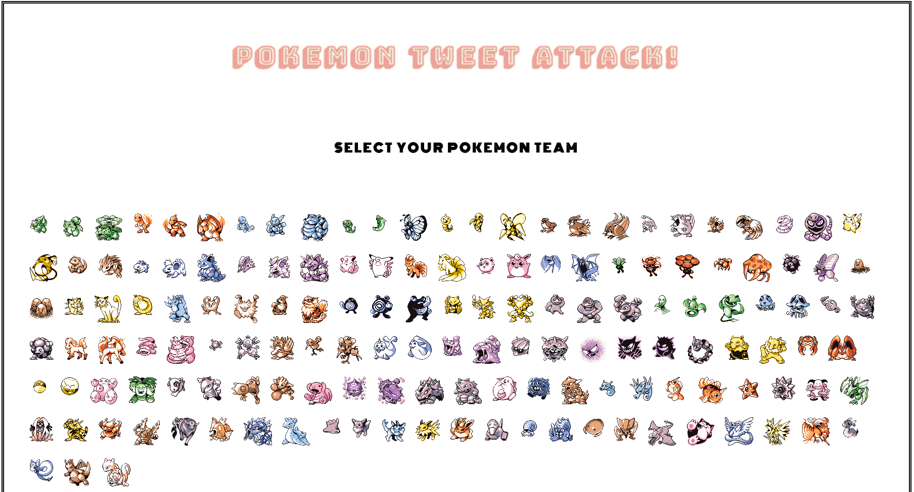

[Pokemon Tweet Attack](http://pokemon-tweet-attack.herokuapp.com/) is a browser game made with Ruby on Rails, JavaScript, jQuery, CSS3/HTML5, and various APIs.

## API Technologies

## Pokemon API

 - RESTful calls are made to the [Pokemon API](https://pokeapi.co/), returning JSON objects, whereafter AJAX posts to the rails backend attach images and gifs to each object from [pokemondb](https://pokemondb.net/) before being returned to front-end. When individual pokemon are played, a separate AJAX call is made to the Pokemon API to return a more complete JSON of the pokemon with detailed stats, along with all of the pokemon's moves. Initiating a pokemon attack sends another AJAX request to receive a JSON containing data on the attack move, including its accuracy and power.

## Twitter API

 - The app uses the ruby [Twitter Gem](https://github.com/sferik/twitter) and [Twitter API](https://dev.twitter.com/rest/public) in the twitter controller to fetch tweets relating to the current pokemon, filtering only tweets of the English language within a 1000 mile radius of New York City. Information from the tweet, including the username, profile, tweet favorites, retweets and tweet location are used to render custom tweet displays.

## IBM Watson
 - When a Tweet Attack is selected, an AJAX post to the tones controller is made containing the tweet's message. Thereafter, a RESTful call to [IBM Watson's Tone Analyzer](https://www.ibm.com/watson/developercloud/tone-analyzer.html) with the tweet message returns a JSON with emotional scores for Anger, Disgust, Joy, Sadness, and Fear. Game logic on the front-end uses these scores to determine an attack.

## Giphy API

 - The combination of a pokemon attack selected based based on the emotional score and the pokemon name creates a query used in an AJAX call to the [Giphy API](https://api.giphy.com/) returning a collection of gifs relating to the attack move and pokemon name. A random gif from the collection is chosen and subsequently rendered.

## HOW TO PLAY

### Select Pokemon Team!
First select your pokemon team! Power and stats matter as each pokemon contains unique defense, attack, and health. Be careful, however, as having a strong pokemon might not necessarily mean you will be able to use the best attacks. Afterwards, select the first pokemon you wish to battle with.

